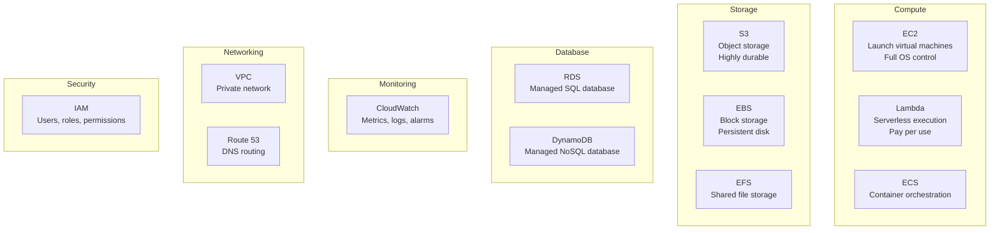

```mermaid
flowchart TB

%% Compute
subgraph Compute
EC2["EC2
Launch virtual machines
Full OS control"]

Lambda["Lambda
Serverless execution
Pay per use"]

ECS["ECS
Container orchestration"]
end

%% Storage
subgraph Storage
S3["S3
Object storage
Highly durable"]

EBS["EBS
Block storage
Persistent disk"]

EFS["EFS
Shared file storage"]
end

%% Database
subgraph Database
RDS["RDS
Managed SQL database"]

DynamoDB["DynamoDB
Managed NoSQL database"]
end

%% Monitoring
subgraph Monitoring
CloudWatch["CloudWatch
Metrics, logs, alarms"]
end

%% Networking
subgraph Networking
VPC["VPC
Private network"]

Route53["Route 53
DNS routing"]
end

%% Security
subgraph Security
IAM["IAM
Users, roles, permissions"]
end
```
